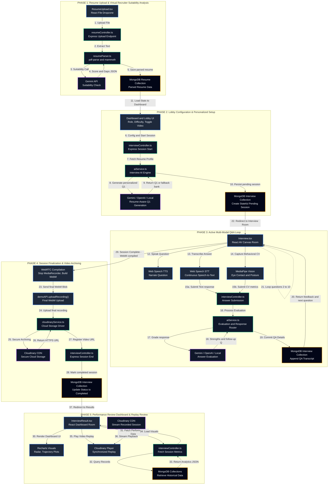

# AI Mock Interview Platform

A full-stack AI-powered interview preparation platform with real-time video recording, live coding environment, intelligent question generation, and detailed performance analytics.

## Features

- **AI-Powered Interviews** — Resume-aware dynamic question generation using Gemini when `GEMINI_API_KEY` is configured, with OpenAI and local fallbacks
- **Google OAuth Authentication** — Secure sign-in via Google's OAuth 2.0 / OpenID Connect with server-side identity verification
- **Video Recording** — Browser camera/microphone capture with `getUserMedia()` and `MediaRecorder`, with the completed WebM recording stored on Cloudinary
- **Live Coding Environment** — Monaco Editor with multi-language support (JavaScript, Python, C++)
- **Body Language Analysis** — MediaPipe-based face detection tracking eye contact, head pose, and engagement metrics
- **Resume Parsing** — PDF and DOCX parsing to extract skills, projects, and work experience
- **Analytics Dashboard** — Score trends, weak area identification, radar charts, and performance tracking
- **Transcript & Replay** — Full interview transcript with Q&A review and synchronized video playback

## System Architecture & Data Flow

The platform is designed with a highly integrated, multi-modal system architecture. The flowchart below shows how all client sub-systems, Express controllers, database models, and cloud APIs interact in real-time across five distinct phases.



---

## Step-by-Step Execution Flow

### Phase 1: Authentication & Onboarding

1. **Google OAuth Sign-in:** The candidate clicks **"Continue with Google"** on the login or register page. The backend initiates an OAuth 2.0 Authorization Code flow — the user authenticates directly with Google, and Google returns a verified identity. The backend verifies Google's ID token (signature, issuer, audience, email verification), finds or creates the user in MongoDB by Google's stable `sub` identifier, and generates an application **JSON Web Token (JWT)**. The JWT is delivered to the frontend via a secure one-time authorization code exchange.

2. **Resume Upload:** The candidate uploads their resume (PDF or DOCX) via `ResumeUpload.tsx`.

3. **Parsing & Text Extraction:** The Express API endpoint `POST /api/resume/upload` receives the file. Inside `resumeParser.ts`, the file extension is detected automatically — `pdf-parse` handles PDFs and `mammoth` handles DOCX files.

4. **AI Suitability Check:** The extracted resume data is analyzed with **Gemini when `GEMINI_API_KEY` is configured**. If Gemini is unavailable or not configured, the backend uses local keyword matching. The response contains a suitability score, matched skills, missing skills, and recommendations.

5. **Database Storage:** The parsed skills, projects, and experience are stored in MongoDB under the `Resume` model, linked to the user. The resume suitability-analysis response is returned by the endpoint and is not stored as a separate analysis field.

### Phase 2: Interview Configuration & Session Start

6. **Lobby Customization:** The user selects their target role, interview duration, difficulty level (Easy, Medium, or Hard), and optionally enables Video Recording. They then click **Start Interview**.

7. **Session Initialization:** The frontend sends `POST /api/interview/start`. `interviewController.ts` creates a stateful `Interview` document in MongoDB with a `pending` status.

8. **AI-Powered Question 1 Generation:** In the backend, `aiService.ts` uses the interview role, type, difficulty, resume skills/projects/experience, and previous questions to generate a personalized question. **Gemini** is used when `GEMINI_API_KEY` is configured, with **OpenAI** and then a local question bank as fallbacks. The local bank covers DSA, System Design, Databases, HR, and Project-based categories.

9. **Session Delivery:** The generated question is returned to the browser, redirecting the user to the Interview room (`Interview.tsx`).

### Phase 3: Active Multi-Modal Q&A Loop

10. **AV Streams & Body Language Tracking:** The browser activates the camera and microphone with `navigator.mediaDevices.getUserMedia()` and records the stream with `MediaRecorder`. The `useBodyLanguageAnalysis` hook runs **MediaPipe Face Landmarker** in the browser and aggregates metrics such as eye contact, face orientation/centering, head stability, and face visibility.

11. **Question Narration (TTS):** The browser's **Web Speech Synthesis API** reads the generated question aloud, acting as the voice of the AI interviewer.

12. **Speech-to-Text Transcription:** The candidate responds by typing, or by toggling **Voice Input** which activates the browser's built-in **Web Speech Recognition API** (`webkitSpeechRecognition`) to transcribe spoken words into the answer text field in real-time.

13. **Answer Submission & Evaluation:** The user clicks **Submit Answer**, sending the response to `POST /api/interview/submit-answer/:interviewId`.
    - `aiService.ts` evaluates the answer using **Gemini when configured**, with OpenAI and local evaluation fallbacks. Evaluation considers technical accuracy, depth, practical examples, communication clarity, relevance, and difficulty.
    - The API returns a structured JSON response containing:
      - **Score:** A 1–5 scale rating.
      - **Overall Feedback:** A detailed assessment of the answer.
      - **Strengths:** 2–3 specific elements the candidate explained well.
      - **Areas for Improvement:** Actionable notes on missing or weak points.
      - **Follow-up Question:** A deeper, context-aware question based on what the candidate just answered.
    - **Fallback Mode:** If the OpenAI API is unavailable, a local tokenization service analyzes word overlap against ideal answer templates, scoring based on structural completeness, use of examples, and minimum response length.

14. **Question Loop:** The candidate receives immediate color-coded feedback on screen, then clicks **Next Question** to proceed to the follow-up or the next core question. This loop continues for up to 10 questions.

### Phase 4: Session End & Video Archiving

15. **Stop Capture:** The interview ends when 10 questions are complete, when the user manually ends the session, or when the timer expires.
    - The `MediaRecorder` is stopped, compiling all buffered chunks into a single WebM video blob.
    - The MediaPipe vision loop halts, consolidating all tracking metrics into averaged behavioral scores.

16. **Session Finalization:** The frontend triggers `POST /api/interview/end/:interviewId`, sending the aggregated body-language metrics to the server. The server marks the interview completed, calculates the final score, identifies strong/improvement areas, generates a closing message, and updates the `Interview` document in MongoDB.

17. **Cloud Video Upload:** After the interview-end request, the final WebM blob is uploaded via `POST /api/demo/upload-recording/:interviewId`. The backend uploads it to **Cloudinary** and saves the recording URL, public ID, and duration in the interview record.

### Phase 5: Analytics Dashboard & Replay

18. **Results Page:** The candidate is redirected to `InterviewResult.tsx`.

19. **Performance Visualization:** The page fetches the complete interview record and renders interactive Recharts visualizations — radar charts for category scores, score trajectory plots, and body language compliance metrics.

20. **Video Replay:** The candidate can review their complete Q&A transcript alongside graded feedback, and play back their recorded session directly via the integrated Cloudinary video player.

---

## Tech Stack

### Frontend
| Technology | Purpose |
|---|---|
| React 18 + TypeScript | Core UI framework |
| Vite | Build tool and dev server |
| Tailwind CSS | Utility-first styling |
| Zustand | Global state management |
| React Router DOM v6 | Client-side routing |
| Framer Motion | Animations and transitions |
| Radix UI | Accessible headless components |
| Monaco Editor | In-browser code editor |
| Recharts | Performance analytics charts |
| Axios | HTTP client |
| MediaPipe Tasks Vision | Real-time face and body tracking |
| MediaRecorder + getUserMedia (browser APIs) | Camera/microphone capture and WebM recording |
| Web Speech API (browser) | Text-to-speech (TTS) and speech-to-text (STT) |

### Backend
| Technology | Purpose |
|---|---|
| Node.js + Express | REST API server |
| TypeScript | Type-safe backend code |
| MongoDB + Mongoose | Database and ODM |
| Google OAuth 2.0 (google-auth-library) | Authentication via Google OpenID Connect |
| JSON Web Tokens (JWT) | Application session tokens |
| Gemini API + OpenAI API | AI question generation, resume suitability analysis, and answer evaluation |
| Cloudinary | Cloud video storage and streaming |
| multer | File upload handling |
| pdf-parse + mammoth | Resume parsing (PDF and DOCX) |
| socket.io | Real-time communication |
| helmet | HTTP security headers |
| express-validator | Input validation |
| cookie-parser | OAuth state cookie handling |

## Project Structure

This folder tree represents the actual set of files tracked in Git and pushed to GitHub:

```
AI-Mock-Interview-Platform/
├── backend/                             # Express Backend Service
│   ├── src/
│   │   ├── config/                      # Database & config entrypoint
│   │   │   ├── db.ts
│   │   │   └── index.ts
│   │   ├── controllers/                 # Express controllers for routes
│   │   │   ├── authController.ts        # Google OAuth, code exchange, profile/settings
│   │   │   ├── interviewController.ts
│   │   │   ├── resumeController.ts
│   │   │   └── videoController.ts
│   │   ├── middleware/                  # Endpoint routers validation & upload rules
│   │   │   ├── auth.ts                  # JWT verification, generateToken, AuthRequest
│   │   │   ├── errorHandler.ts
│   │   │   ├── fileValidation.ts
│   │   │   ├── upload.ts
│   │   │   └── validation.ts
│   │   ├── models/                      # Mongoose models schema
│   │   │   ├── Interview.ts
│   │   │   ├── Resume.ts
│   │   │   └── User.ts                  # googleId, email, name, role, profileImage
│   │   ├── routes/                      # API routing endpoints
│   │   │   ├── analytics.ts
│   │   │   ├── auth.ts                  # /google, /google/callback, /exchange, /me, /profile, /settings
│   │   │   ├── coding.ts
│   │   │   ├── demo.ts
│   │   │   ├── interview.ts
│   │   │   ├── resume.ts
│   │   │   └── video.ts
│   │   ├── services/                    # Business core logic
│   │   │   ├── aiService.ts
│   │   │   ├── cloudinaryService.ts
│   │   │   ├── codingService.ts
│   │   │   ├── resumeParser.ts
│   │   │   └── videoService.ts
│   │   ├── types/                       # Custom TypeScript types
│   │   │   ├── declarations.d.ts
│   │   │   └── file-type.d.ts
│   │   ├── utils/                       # DB helpers
│   │   │   ├── codingChallenges.ts      # Built-in coding challenge bank
│   │   │   └── dropDuplicateIndex.ts    # Legacy index cleanup utility
│   │   └── index.ts                     # Express app main listener
│   ├── uploads/                         # PDF resume uploads directory
│   ├── .env.example
│   ├── package.json
│   ├── package-lock.json
│   └── tsconfig.json
├── frontend/                            # React Client (Vite + TypeScript)
│   ├── src/
│   │   ├── components/                  # Premium visual elements and canvas elements
│   │   │   ├── 3d/                      # Three.js / Canvas setups
│   │   │   │   ├── AnimatedCanvas.tsx
│   │   │   │   └── BackgroundScene.tsx
│   │   │   ├── ui/                      # Base visual elements (buttons, inputs)
│   │   │   │   ├── badge.tsx, button.tsx, card.tsx, input.tsx, label.tsx,
│   │   │   │   └── progress.tsx, scroll-area.tsx, sidebar.tsx, switch.tsx, textarea.tsx
│   │   │   ├── AnimatedCard3D.tsx
│   │   │   ├── AnimationHelpers.tsx
│   │   │   ├── ErrorBoundary.tsx
│   │   │   ├── Logo.tsx
│   │   │   ├── ParticleEffect.tsx
│   │   │   ├── ScrollAnimations.tsx
│   │   │   ├── SmoothScrollProvider.tsx
│   │   │   ├── ThemeToggle.tsx
│   │   │   ├── VideoPlayer.tsx
│   │   │   └── theme-provider.tsx
│   │   ├── hooks/                       # Custom hooks (facial expression tracker)
│   │   │   └── useBodyLanguageAnalysis.ts
│   │   ├── lib/                         # Monaco & scroll helper functions
│   │   │   ├── smoothScroll.ts
│   │   │   └── utils.ts
│   │   ├── pages/                       # Screen views and dashboard boards
│   │   │   ├── Analytics.tsx
│   │   │   ├── AuthCallback.tsx         # Google OAuth one-time code exchange
│   │   │   ├── CodingChallenges.tsx
│   │   │   ├── Dashboard.tsx
│   │   │   ├── DemoPage.tsx
│   │   │   ├── Interview.tsx
│   │   │   ├── InterviewResult.tsx
│   │   │   ├── InterviewSetup.tsx
│   │   │   ├── LandingPage.tsx
│   │   │   ├── LiveCodingEditor.tsx
│   │   │   ├── Login.tsx                # "Continue with Google" button
│   │   │   ├── Profile.tsx
│   │   │   ├── Register.tsx             # "Continue with Google" button
│   │   │   ├── ResumeUpload.tsx
│   │   │   ├── Settings.tsx
│   │   │   └── VideoLibrary.tsx
│   │   ├── services/                    # Axios clients and core endpoints API
│   │   │   └── api.ts
│   │   ├── store/                       # Zustand auth persistence state
│   │   │   └── authStore.ts
│   │   ├── types/                       # Client TS types
│   │   │   └── index.ts
│   │   ├── App.tsx                      # Frontend router & page wrapper
│   │   ├── index.css                    # Entry tailwind styling rules
│   │   ├── main.tsx                     # React client bootstrap entry
│   │   └── vite-env.d.ts
│   ├── index.html
│   ├── package.json
│   ├── package-lock.json
│   ├── postcss.config.js
│   ├── tailwind.config.js
│   ├── tsconfig.json
│   ├── tsconfig.node.json
│   └── vite.config.ts
├── .gitignore
├── package.json                         # Workspace monorepo root package file
├── render.yaml                          # Render hosting configurations
├── SPEC.md                              # Backend specification reference
└── README.md                            # Comprehensive README & Flow diagram (This file)
```

## Setup & Installation

### Prerequisites

- **Node.js** v18 or higher
- **MongoDB** (local instance or MongoDB Atlas)
- **Google Cloud Console project** with OAuth 2.0 credentials — [console.cloud.google.com](https://console.cloud.google.com)
- **Gemini and/or OpenAI API Key**
- **Cloudinary Account** — [cloudinary.com](https://cloudinary.com) (free tier is sufficient)

### 1. Clone the Repository

```bash
git clone https://github.com/anuragverma4895/AI-Mock-Interview-Platform.git
cd AI-Mock-Interview-Platform
```

### 2. Google OAuth Setup (Required)

Before running the app, you need to configure Google OAuth credentials:

1. Go to [Google Cloud Console](https://console.cloud.google.com/)
2. Create a new project or select an existing one
3. Navigate to **APIs & Services → OAuth consent screen**
   - Select **External** user type
   - Fill in app name (`PrepVerse`), support email, and developer email
   - Add scopes: `email`, `profile`, `openid`
   - Add your Google email under **Test users** (required while in Testing mode)
4. Navigate to **APIs & Services → Credentials**
   - Click **Create Credentials → OAuth client ID**
   - Application type: **Web application**
   - **Authorized JavaScript origins:**
     - `http://localhost:3000`
     - `http://localhost:5005`
   - **Authorized redirect URIs:**
     - `http://localhost:5005/api/auth/google/callback`
   - Click **Create** and copy the **Client ID** and **Client Secret**

### 3. Backend Setup

```bash
cd backend
npm install
```

Create a `.env` file in the `backend/` directory (use `.env.example` as a template):

```env
PORT=5005
MONGODB_URI=mongodb://localhost:27017/ai-interview
JWT_SECRET=your-super-secret-jwt-key-change-in-production
NODE_ENV=development
GEMINI_API_KEY=your-gemini-api-key
OPENAI_API_KEY=your-openai-api-key
CLOUDINARY_CLOUD_NAME=your-cloudinary-cloud-name
CLOUDINARY_API_KEY=your-cloudinary-api-key
CLOUDINARY_API_SECRET=your-cloudinary-api-secret

# Google OAuth 2.0 (required)
GOOGLE_CLIENT_ID=your-google-client-id.apps.googleusercontent.com
GOOGLE_CLIENT_SECRET=your-google-client-secret
GOOGLE_REDIRECT_URI=http://localhost:5005/api/auth/google/callback
FRONTEND_URL=http://localhost:3000
```

Start the backend development server:

```bash
npm run dev
```

The backend API will be available at `http://localhost:5005` by default.

### 4. Frontend Setup

```bash
cd frontend
npm install
npm run dev
```

The frontend development server will be available at `http://localhost:3000`.

### 5. Run Both Concurrently (from the root)

```bash
npm run dev
```

## Authentication Flow

The platform uses **Google OAuth 2.0** with a server-side Authorization Code flow. No passwords are stored — Google verifies the user's identity directly.

```
User clicks "Continue with Google"
  → Browser navigates to GET /api/auth/google
  → Backend generates CSRF state (stored in HTTP-only cookie)
  → Redirects to Google's OAuth consent screen
  → User authenticates with their Google account
  → Google redirects to GET /api/auth/google/callback
  → Backend validates CSRF state
  → Backend exchanges authorization code with Google
  → Backend verifies Google's ID token (signature, issuer, audience, expiration)
  → MongoDB: find user by googleId or create new user
  → Generate application JWT (2-hour expiry)
  → Create one-time authorization code (60-second TTL)
  → Redirect to frontend /auth/callback?code=<one-time-code>
  → Frontend exchanges code for JWT via POST /api/auth/exchange
  → JWT stored in localStorage
  → User redirected to Dashboard
  → All subsequent API requests include JWT in Authorization header
```

## API Endpoints

### Authentication
| Method | Endpoint | Description |
|---|---|---|
| `GET` | `/api/auth/google` | Initiates Google OAuth flow (redirects to Google) |
| `GET` | `/api/auth/google/callback` | Google OAuth callback (handled by backend) |
| `POST` | `/api/auth/exchange` | Exchange one-time code for JWT and user data |
| `GET` | `/api/auth/me` | Get the currently authenticated user |
| `PATCH` | `/api/auth/profile` | Update user profile (name, role) |
| `PATCH` | `/api/auth/settings` | Update user settings (role) |
| `POST` | `/api/auth/logout` | Server-side logout |

### Resume
| Method | Endpoint | Description |
|---|---|---|
| `POST` | `/api/resume/upload` | Upload a resume (multipart/form-data) |
| `GET` | `/api/resume/:id` | Get a resume by ID |
| `GET` | `/api/resume/user/:userId` | Get all resumes for a user |
| `DELETE` | `/api/resume/:id` | Delete a resume |

### Interview
| Method | Endpoint | Description |
|---|---|---|
| `POST` | `/api/interview/start` | Start a new interview session |
| `GET` | `/api/interview/next-question/:interviewId` | Get the next question |
| `POST` | `/api/interview/submit-answer/:interviewId` | Submit an answer for evaluation |
| `POST` | `/api/interview/follow-up/:interviewId` | Ask a follow-up question |
| `POST` | `/api/interview/end/:interviewId` | End the interview session |
| `GET` | `/api/interview/:id` | Get interview details |
| `GET` | `/api/interview/user/:userId` | Get all interviews for a user |
| `GET` | `/api/interview/transcript/:id` | Get the full interview transcript |

### Video
| Method | Endpoint | Description |
|---|---|---|
| `POST` | `/api/video/upload-chunk` | Upload a video chunk |
| `POST` | `/api/video/finalize` | Finalize and commit the video |
| `GET` | `/api/video/:id` | Get video metadata |
| `GET` | `/api/video/:id/download` | Download the recorded video |
| `POST` | `/api/video/analyze-body-language` | Currently returns HTTP 501; active body-language metrics are sent through `/api/interview/end/:interviewId` |

### Demo Recordings
| Method | Endpoint | Description |
|---|---|---|
| `POST` | `/api/demo/upload-recording/:interviewId` | Upload interview recording (WebM or base64) |
| `POST` | `/api/demo/publish/:interviewId` | Publish a recording publicly |
| `POST` | `/api/demo/unpublish/:interviewId` | Unpublish a recording |
| `DELETE` | `/api/demo/recording/:interviewId` | Delete a recording |
| `GET` | `/api/demo/my-recordings` | Get all recordings for the authenticated user |
| `GET` | `/api/demo/public` | Get all publicly published recordings |

### Coding
| Method | Endpoint | Description |
|---|---|---|
| `GET` | `/api/coding/challenges` | Get available coding challenges |
| `POST` | `/api/coding/start` | Start a coding session |
| `POST` | `/api/coding/submit/:interviewId` | Submit code for evaluation |
| `GET` | `/api/coding/sessions` | Get all coding sessions for the user |
| `GET` | `/api/coding/sessions/:interviewId` | Get a specific coding session |
| `POST` | `/api/coding/generate` | Generate an AI coding challenge |

### Analytics
| Method | Endpoint | Description |
|---|---|---|
| `GET` | `/api/analytics/:userId` | Get analytics summary for a user |
| `GET` | `/api/analytics/interview/:id` | Get analytics for a specific interview |

## Environment Variables Reference

### Backend (`backend/.env`)

| Variable | Required | Description |
|---|---|---|
| `PORT` | No | Port for the Express server (default: `5005`) |
| `MONGODB_URI` | Yes | MongoDB connection string |
| `JWT_SECRET` | Yes | Secret key for signing application JWTs |
| `NODE_ENV` | No | `development` or `production` |
| `GEMINI_API_KEY` | Conditional | Gemini API key; enables the primary Gemini AI path |
| `OPENAI_API_KEY` | Conditional | OpenAI API key; fallback AI path |
| `CLOUDINARY_CLOUD_NAME` | Yes | Cloudinary cloud name |
| `CLOUDINARY_API_KEY` | Yes | Cloudinary API key |
| `CLOUDINARY_API_SECRET` | Yes | Cloudinary API secret |
| `GOOGLE_CLIENT_ID` | Yes | Google OAuth 2.0 Client ID from Google Cloud Console |
| `GOOGLE_CLIENT_SECRET` | Yes | Google OAuth 2.0 Client Secret from Google Cloud Console |
| `GOOGLE_REDIRECT_URI` | Yes | OAuth callback URL (default: `http://localhost:5005/api/auth/google/callback`) |
| `FRONTEND_URL` | Yes | Frontend URL for OAuth redirects (default: `http://localhost:3000`) |

## Deployment

### Render (Single Service — Backend serves Frontend)

The project is deployed on [Render](https://render.com) as a single web service where the Express backend serves the Vite-built frontend in production.

1. Connect your GitHub repository on [render.com](https://render.com).
2. Select **Web Service** and set the **root directory** to `backend`.
3. Build command: `npm run build`
4. Start command: `npm start`
5. Add all environment variables in the Render dashboard:

| Variable | Value |
|---|---|
| `NODE_ENV` | `production` |
| `MONGODB_URI` | Your MongoDB Atlas connection string |
| `JWT_SECRET` | Your secret JWT signing key |
| `GEMINI_API_KEY` | Your Gemini API key |
| `CLOUDINARY_CLOUD_NAME` | Your Cloudinary cloud name |
| `CLOUDINARY_API_KEY` | Your Cloudinary API key |
| `CLOUDINARY_API_SECRET` | Your Cloudinary API secret |
| `GOOGLE_CLIENT_ID` | Your Google OAuth Client ID |
| `GOOGLE_CLIENT_SECRET` | Your Google OAuth Client Secret |
| `GOOGLE_REDIRECT_URI` | `https://<your-render-url>.onrender.com/api/auth/google/callback` |
| `FRONTEND_URL` | `https://<your-render-url>.onrender.com` |

6. In Google Cloud Console → Credentials → your OAuth client, add your Render URL:
   - **Authorized JavaScript origins:** `https://<your-render-url>.onrender.com`
   - **Authorized redirect URIs:** `https://<your-render-url>.onrender.com/api/auth/google/callback`

A `render.yaml` configuration file is included in the repository root for assisted deployment.

### Database — MongoDB Atlas

1. Create a free-tier cluster on [mongodb.com/atlas](https://www.mongodb.com/atlas).
2. Add your server's IP to the Atlas IP Access List.
3. Copy the connection string and set it as `MONGODB_URI` in your backend environment.

## Security

- **Google OAuth 2.0** — Users authenticate directly with Google; no passwords are stored
- **ID Token Verification** — Google's ID token is verified server-side for signature, issuer, audience, and expiration
- **CSRF Protection** — Cryptographic state parameter stored in HTTP-only cookie during OAuth flow
- **One-Time Code Exchange** — JWT is never exposed in URLs; delivered via single-use, 60-second TTL authorization codes
- **JWT Authentication** — All protected routes require a valid Bearer token (2-hour expiry)
- **User Ownership** — All resources (interviews, resumes, recordings) are scoped to the authenticated user's MongoDB `_id`
- **CORS Configuration** — Restricted to allowed origins
- **Helmet** — Sets secure HTTP response headers
- **File Type Validation** — Resume uploads are validated for allowed MIME types
- **Input Validation** — All API inputs are validated with `express-validator`

---

## License

MIT