# AI Mock Interview Platform - Complete Full Stack Application

A professional AI-powered interview platform with real-time video recording, live coding environment, and intelligent question generation.

## Features

- **AI-Powered Interviews**: Dynamic question generation based on resume data
- **Video Recording**: WebRTC-based real-time webcam and microphone recording
- **Live Coding Environment**: Monaco Editor with multi-language support (JS, Python, C++)
- **Body Language Analysis**: Face detection and engagement metrics
- **Resume Parsing**: PDF/DOCX parsing to extract skills, projects, and experience
- **Analytics Dashboard**: Score trends, weak areas, and performance tracking
- **Transcript & Replay**: Full interview transcript with Q&A review

## System Architecture & Data Flow

The platform is designed with a highly integrated multi-modal system architecture. Below is the end-to-end user journey and data pathway, from resume upload to real-time WebRTC recording, live computer vision tracking via MediaPipe, dynamic Gemini question generation, grading, and video hosting.

```mermaid
graph TD
    %% Define styles
    classDef frontend fill:#3b82f6,stroke:#1d4ed8,stroke-width:2px,color:#fff
    classDef backend fill:#10b981,stroke:#047857,stroke-width:2px,color:#fff
    classDef database fill:#f59e0b,stroke:#b45309,stroke-width:2px,color:#fff
    classDef external fill:#8b5cf6,stroke:#6d28d9,stroke-width:2px,color:#fff

    subgraph FE ["Frontend (React / TS / Framer Motion / Three.js)"]
        Dashboard["Landing / Dashboard UI"]:::frontend
        ResumeUpload["Resume Upload UI"]:::frontend
        RoomConfig["Interview Setup Room"]:::frontend
        InterviewScreen["Active Interview Page ('Alex')"]:::frontend
        WebcamStream["WebRTC Video/Audio Streaming"]:::frontend
        MediaPipeCV["MediaPipe Eye/Pose Tracking"]:::frontend
        SpeechRec["Web Speech API (Transcription)"]:::frontend
        SpeechSynth["Web Speech API (TTS Reader)"]:::frontend
        ResultsPage["Interview Results Screen"]:::frontend
    end

    subgraph BE ["Backend (Node.js / Express.js / TypeScript)"]
        AuthCtrl["authController.ts"]:::backend
        ResumeCtrl["resumeController.ts"]:::backend
        ParserServ["resumeParser.ts"]:::backend
        InterviewCtrl["interviewController.ts"]:::backend
        AIServ["aiService.ts"]:::backend
        VideoCtrl["videoController.ts"]:::backend
        CloudinaryServ["cloudinaryService.ts"]:::backend
    end

    subgraph DB ["Database (MongoDB / Mongoose)"]
        UserColl[("Users Collection")]:::database
        ResumeColl[("Resumes Collection")]:::database
        InterviewColl[("Interviews Collection")]:::database
    end

    subgraph EXT ["APIs & External Services"]
        GeminiAPI["Gemini API (gemini-flash-latest)"]:::external
        OpenAIAPI["OpenAI API (GPT-3.5 Fallback)"]:::external
        CloudinaryAPI["Cloudinary Video Cloud"]:::external
    end

    %% Phase 1: Onboarding & Resume
    Dashboard -->|"1. Upload Resume"| ResumeUpload
    ResumeUpload -->|"2. POST /api/resume/upload"| ResumeCtrl
    ResumeCtrl -->|"3. Extract text"| ParserServ
    ParserServ -->|"4. Parse PDF/DOCX"| ParserServ
    ParserServ -->|"5. Suitability analysis request"| GeminiAPI
    GeminiAPI -->|"6. Score, skills match/gaps, tips"| ParserServ
    ParserServ -->|"7. Save parsed resume & score"| ResumeColl

    %% Phase 2: Start Interview
    Dashboard -->|"8. Start Session"| RoomConfig
    RoomConfig -->|"9. POST /api/interview/start"| InterviewCtrl
    InterviewCtrl -->|"10. Generate Q1"| AIServ
    AIServ -->|"11. Query parsed resume profile"| ResumeColl
    AIServ -->|"12. Generate context-aware question"| GeminiAPI
    AIServ -.->|"Fallback: 31+ Question Bank"| AIServ
    InterviewCtrl -->|"13. Create interview (Pending)"| InterviewColl
    InterviewCtrl -->|"14. Return Q1 & Greeting"| InterviewScreen

    %% Phase 3: Active Q&A Loop
    InterviewScreen -->|"15. Start WebRTC Session"| WebcamStream
    InterviewScreen -->|"16. Speak question (TTS)"| SpeechSynth
    WebcamStream -->|"17. Track eye contact & pose"| MediaPipeCV
    InterviewScreen -->|"18. Capture voice answer"| SpeechRec
    SpeechRec -->|"19. Transcribe speech"| InterviewScreen
    
    InterviewScreen -->|"20. Submit Answer"| InterviewCtrl
    InterviewCtrl -->|"21. Grade response"| AIServ
    AIServ -->|"22. Evaluate accuracy, examples"| GeminiAPI
    AIServ -.->|"Fallback: Token keyword matching"| AIServ
    InterviewCtrl -->|"23. Update question & transcript"| InterviewColl
    InterviewCtrl -->|"24. Return Score & follow-up"| InterviewScreen
    InterviewScreen -->|"25. Render feedback"| InterviewScreen
    InterviewScreen -->|"26. Loop Questions (1-10)"| InterviewScreen

    %% Phase 4: Finalization & Upload
    InterviewScreen -->|"27. End interview"| InterviewScreen
    InterviewScreen -->|"28. Stop WebRTC & get WebM Blob"| WebcamStream
    InterviewScreen -->|"29. Halt CV tracking"| MediaPipeCV
    InterviewScreen -->|"30. POST /api/interview/end (with CV metrics)"| InterviewCtrl
    InterviewCtrl -->|"31. Produce final summary"| GeminiAPI
    InterviewCtrl -->|"32. Update status & scores"| InterviewColl
    
    InterviewScreen -->|"33. Stream WebM"| VideoCtrl
    VideoCtrl -->|"34. Upload to Cloud"| CloudinaryServ
    CloudinaryServ -->|"35. Send to secure bucket"| CloudinaryAPI
    CloudinaryAPI -->|"36. Return secure URL"| CloudinaryServ
    VideoCtrl -->|"37. Save video reference"| InterviewColl

    %% Phase 5: Dashboard Visualization
    InterviewScreen -->|"38. Redirect"| ResultsPage
    ResultsPage -->|"39. GET /api/interview/:id"| InterviewCtrl
    InterviewCtrl -->|"40. Retrieve database entry"| InterviewColl
    ResultsPage -->|"41. Render analytics & play video"| ResultsPage
    CloudinaryAPI -->|"42. Play hosted video"| ResultsPage
```



## Tech Stack

### Frontend
- React 18 + TypeScript
- Tailwind CSS
- Zustand (State Management)
- Monaco Editor (Code Editor)
- WebRTC (Video/Audio)

### Backend
- Node.js + Express
- MongoDB (Mongoose)
- JWT Authentication
- OpenAI API (LLM Integration)

## Project Structure

```
ai-interview-bot/
├── backend/
│   ├── src/
│   │   ├── config/         # Database configuration
│   │   ├── controllers/    # Route controllers
│   │   ├── middleware/     # Auth & upload middleware
│   │   ├── models/         # Mongoose models
│   │   ├── routes/         # API routes
│   │   ├── services/       # Business logic (AI, Resume Parser, Video)
│   │   └── index.ts        # Main server file
│   ├── uploads/            # File uploads directory
│   ├── package.json
│   └── tsconfig.json
├── frontend/
│   ├── src/
│   │   ├── components/     # React components
│   │   ├── pages/          # Page components
│   │   ├── store/          # Zustand stores
│   │   ├── services/       # API services
│   │   ├── types/          # TypeScript types
│   │   └── App.tsx         # Main app component
│   ├── package.json
│   └── vite.config.ts
├── SPEC.md                 # Technical specification
└── README.md               # This file
```

## Setup Instructions

### Prerequisites
- Node.js 18+
- MongoDB (local or Atlas)
- OpenAI API Key

### Backend Setup

1. Navigate to backend directory:
```bash
cd backend
```

2. Install dependencies:
```bash
npm install
```

3. Create `.env` file:
```env
PORT=5000
MONGODB_URI=mongodb://localhost:27017/ai-interview
JWT_SECRET=your-super-secret-jwt-key-change-in-production
NODE_ENV=development
OPENAI_API_KEY=your-openai-api-key-here
```

4. Start the backend server:
```bash
npm run dev
```

The server will run at `http://localhost:5000`

### Frontend Setup

1. Navigate to frontend directory:
```bash
cd frontend
```

2. Install dependencies:
```bash
npm install
```

3. Start the development server:
```bash
npm run dev
```

The application will run at `http://localhost:3000`

## API Endpoints

### Authentication
- `POST /api/auth/register` - Register new user
- `POST /api/auth/login` - Login user
- `GET /api/auth/me` - Get current user

### Resume
- `POST /api/resume/upload` - Upload resume (multipart/form-data)
- `GET /api/resume/:id` - Get resume by ID
- `GET /api/resume/user/:userId` - Get user's resumes
- `DELETE /api/resume/:id` - Delete resume

### Interview
- `POST /api/interview/start` - Start new interview
- `GET /api/interview/next-question/:interviewId` - Get next question
- `POST /api/interview/submit-answer/:interviewId` - Submit answer
- `POST /api/interview/end/:interviewId` - End interview
- `GET /api/interview/:id` - Get interview details
- `GET /api/interview/user/:userId` - Get user's interviews
- `GET /api/interview/transcript/:id` - Get transcript

### Video
- `POST /api/video/upload-chunk` - Upload video chunk
- `POST /api/video/finalize` - Finalize video
- `GET /api/video/:id` - Get video info
- `GET /api/video/:id/download` - Download video
- `POST /api/video/analyze-body-language` - Analyze body language

### Analytics
- `GET /api/analytics/:userId` - Get user analytics
- `GET /api/analytics/interview/:id` - Get interview analytics

## Environment Variables

### Backend (.env)
```env
PORT=5000
MONGODB_URI=mongodb://localhost:27017/ai-interview
JWT_SECRET=your-secret-key
OPENAI_API_KEY=sk-your-api-key
```

### Customization Variables
```env
{{INTERVIEW_DURATION}} = 45 minutes
{{ROLE}} = "Full Stack Developer"
{{DIFFICULTY}} = "Mixed"
{{MAX_QUESTIONS}} = 15
```

## Deployment

### Frontend (Vercel)
1. Push code to GitHub
2. Import project on Vercel
3. Set build command: `npm run build`
4. Set output directory: `dist`
5. Deploy

### Backend (Render/Railway)
1. Connect GitHub repository
2. Set environment variables
3. Build command: `npm run build`
4. Start command: `npm start`

### Database (MongoDB Atlas)
1. Create free tier cluster
2. Get connection string
3. Add to backend environment variables

## Security Features

- JWT authentication for protected routes
- Password hashing with bcrypt
- CORS configuration
- Helmet for HTTP security headers
- File type validation for uploads
- Input validation

## License

MIT